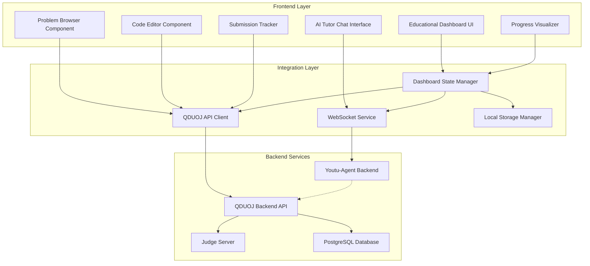
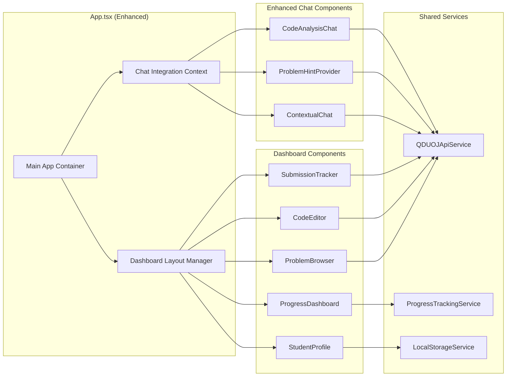

# Design Document

## Overview

This design document outlines the architecture and implementation approach for updating the youtu-agent interface to include educational dashboard features. The solution transforms the current chat-only interface into a comprehensive educational platform that integrates with the existing QDUOJ system, providing problem browsing, submission tracking, and progress visualization while maintaining the powerful AI tutoring capabilities.

The design leverages the existing React/TypeScript frontend architecture and extends it with modular dashboard components that seamlessly integrate with both the QDUOJ backend API and the youtu-agent WebSocket communication system.

## Architecture

### High-Level Architecture



### Component Architecture

The educational dashboard follows a modular component architecture that extends the existing youtu-agent React application:



## Components and Interfaces

### 1. Dashboard Layout Manager

**Purpose**: Orchestrates the layout and navigation between different dashboard views while maintaining chat integration.

**Key Interfaces**:
```typescript
interface DashboardLayoutProps {
  currentView: 'problems' | 'submissions' | 'progress' | 'profile';
  onViewChange: (view: string) => void;
  chatVisible: boolean;
  onToggleChat: () => void;
}

interface DashboardState {
  selectedProblem: Problem | null;
  activeSubmission: Submission | null;
  userProgress: UserProgress;
  chatContext: ChatContext;
}
```

**Responsibilities**:
- Manage responsive layout switching between desktop and mobile views
- Coordinate state between dashboard components and chat interface
- Handle navigation and routing within the dashboard
- Maintain consistent UI theme and styling

### 2. Problem Browser Component

**Purpose**: Provides an intuitive interface for browsing, filtering, and selecting programming problems from QDUOJ.

**Key Interfaces**:
```typescript
interface Problem {
  id: string;
  title: string;
  difficulty: 'Low' | 'Mid' | 'High';
  tags: string[];
  description: string;
  sampleInput: string;
  sampleOutput: string;
  timeLimit: number;
  memoryLimit: number;
  hasTestData: boolean;
  solvedCount: number;
  totalSubmissions: number;
}

interface ProblemBrowserProps {
  problems: Problem[];
  filters: ProblemFilters;
  onProblemSelect: (problem: Problem) => void;
  onFilterChange: (filters: ProblemFilters) => void;
  loading: boolean;
}

interface ProblemFilters {
  difficulty: string[];
  tags: string[];
  status: 'all' | 'solved' | 'unsolved' | 'attempted';
  searchQuery: string;
}
```

**Features**:
- Real-time search and filtering
- Difficulty-based color coding
- Problem status indicators (solved/attempted/new)
- Responsive grid/list view toggle
- Integration with AI tutor for problem recommendations

### 3. Code Editor Component

**Purpose**: Provides a full-featured code editor with syntax highlighting, submission capabilities, and AI integration.

**Key Interfaces**:
```typescript
interface CodeEditorProps {
  problem: Problem;
  initialCode: string;
  language: 'cpp' | 'python' | 'java';
  onLanguageChange: (lang: string) => void;
  onSubmit: (code: string) => void;
  onSave: (code: string) => void;
  submissionResult?: SubmissionResult;
}

interface SubmissionResult {
  id: string;
  status: 'AC' | 'WA' | 'TLE' | 'MLE' | 'CE' | 'RE';
  executionTime: number;
  memoryUsage: number;
  testCasesPassed: number;
  totalTestCases: number;
  errorMessage?: string;
  timestamp: Date;
}
```

**Features**:
- Monaco Editor integration with IntelliSense
- Multi-language support (C++, Python, Java)
- Real-time syntax checking
- Code templates and snippets
- Submission queue management
- Integration with AI tutor for code analysis

### 4. Submission Tracker Component

**Purpose**: Displays submission history, results, and provides detailed feedback on code performance.

**Key Interfaces**:
```typescript
interface Submission {
  id: string;
  problemId: string;
  problemTitle: string;
  code: string;
  language: string;
  result: SubmissionResult;
  timestamp: Date;
}

interface SubmissionTrackerProps {
  submissions: Submission[];
  onSubmissionSelect: (submission: Submission) => void;
  onRetry: (submission: Submission) => void;
  loading: boolean;
}
```

**Features**:
- Chronological submission history
- Filterable by problem, status, or date
- Detailed result analysis
- Code diff comparison between attempts
- Performance metrics visualization

### 5. Progress Dashboard Component

**Purpose**: Visualizes student learning progress, achievements, and provides insights into performance patterns.

**Key Interfaces**:
```typescript
interface UserProgress {
  totalSolved: number;
  totalAttempted: number;
  successRate: number;
  difficultyBreakdown: {
    low: { solved: number; attempted: number };
    mid: { solved: number; attempted: number };
    high: { solved: number; attempted: number };
  };
  topicMastery: TopicMastery[];
  recentActivity: ActivityItem[];
  achievements: Achievement[];
  learningStreak: number;
}

interface TopicMastery {
  topic: string;
  masteryLevel: number; // 0-100
  problemsSolved: number;
  totalProblems: number;
}

interface Achievement {
  id: string;
  title: string;
  description: string;
  icon: string;
  unlockedAt: Date;
  category: 'solving' | 'streak' | 'difficulty' | 'topic';
}
```

**Features**:
- Interactive charts and graphs using Chart.js/D3
- Achievement system with badges
- Learning streak tracking
- Topic mastery radar charts
- Weekly/monthly progress reports

### 6. Enhanced AI Tutor Chat

**Purpose**: Extends the existing chat interface with educational context awareness and problem-specific guidance.

**Key Interfaces**:
```typescript
interface ChatContext {
  currentProblem?: Problem;
  currentSubmission?: Submission;
  userProgress: UserProgress;
  learningObjectives: string[];
}

interface EducationalChatMessage extends Message {
  context?: {
    problemId?: string;
    codeSnippet?: string;
    errorType?: string;
    suggestionType: 'hint' | 'explanation' | 'debugging' | 'optimization';
  };
}
```

**Enhanced Features**:
- Problem-aware conversation context
- Code analysis and debugging assistance
- Algorithm explanation with visual aids
- Personalized learning recommendations
- Progress-based difficulty suggestions

## Data Models

### Core Data Structures

```typescript
// Extended from existing QDUOJ models
interface Problem {
  id: string;
  title: string;
  description: string;
  inputFormat: string;
  outputFormat: string;
  sampleTestCases: TestCase[];
  constraints: string;
  difficulty: 'Low' | 'Mid' | 'High';
  tags: string[];
  timeLimit: number; // milliseconds
  memoryLimit: number; // MB
  hasTestData: boolean;
  createdAt: Date;
  updatedAt: Date;
  statistics: {
    totalSubmissions: number;
    acceptedSubmissions: number;
    successRate: number;
  };
}

interface TestCase {
  input: string;
  expectedOutput: string;
  explanation?: string;
}

interface UserProfile {
  id: string;
  username: string;
  email: string;
  role: 'student' | 'teacher' | 'admin';
  preferences: {
    defaultLanguage: string;
    theme: 'light' | 'dark';
    editorSettings: EditorSettings;
  };
  progress: UserProgress;
  createdAt: Date;
  lastActiveAt: Date;
}

interface EditorSettings {
  fontSize: number;
  tabSize: number;
  wordWrap: boolean;
  minimap: boolean;
  autoSave: boolean;
}

interface ProblemSet {
  id: string;
  title: string;
  description: string;
  problems: string[]; // Problem IDs
  difficulty: 'beginner' | 'intermediate' | 'advanced';
  estimatedTime: number; // hours
  learningObjectives: string[];
  createdBy: string;
  isPublic: boolean;
  createdAt: Date;
}
```

### State Management

The application uses a combination of React Context and local state management:

```typescript
interface DashboardContextType {
  // Problem management
  problems: Problem[];
  selectedProblem: Problem | null;
  problemFilters: ProblemFilters;
  
  // Submission management
  submissions: Submission[];
  activeSubmission: Submission | null;
  
  // User progress
  userProgress: UserProgress;
  achievements: Achievement[];
  
  // UI state
  currentView: DashboardView;
  chatVisible: boolean;
  loading: boolean;
  
  // Actions
  selectProblem: (problem: Problem) => void;
  submitCode: (code: string, language: string) => Promise<void>;
  updateFilters: (filters: ProblemFilters) => void;
  toggleChat: () => void;
}
```

## Correctness Properties

*A property is a characteristic or behavior that should hold true across all valid executions of a system—essentially, a formal statement about what the system should do. Properties serve as the bridge between human-readable specifications and machine-verifiable correctness guarantees.*

Based on the prework analysis, the following properties have been identified as testable and will ensure the correctness of the educational dashboard system:

### Data Display and Filtering Properties

Property 1: Problem Browser Data Integrity
*For any* set of problems retrieved from QDUOJ_System, the Problem_Browser should display all required fields (title, difficulty, tags) correctly for each problem
**Validates: Requirements 1.1**

Property 2: Real-time Filter Consistency
*For any* combination of filters applied to the problem list, the displayed results should contain only problems that match all active filter criteria
**Validates: Requirements 1.2**

Property 3: Problem Detail Completeness
*For any* valid problem selected by a student, the system should display all required problem information (statement, sample I/O, constraints)
**Validates: Requirements 1.3**

Property 4: Problem Context Propagation
*For any* problem being viewed, the AI_Tutor_Chat should have access to the complete problem context (statement, constraints, difficulty)
**Validates: Requirements 1.4, 4.1**

Property 5: Test Data Status Accuracy
*For any* problem in the system, the availability indicator should correctly reflect whether the problem has test data available for submission
**Validates: Requirements 1.5**

### Code Submission and Judging Properties

Property 6: Code Editor Initialization
*For any* problem selected by a student, the system should provide a properly configured code editor with syntax highlighting for the selected programming language
**Validates: Requirements 2.1**

Property 7: Submission Forwarding Integrity
*For any* code submission made by a student, the system should correctly forward the submission data to QDUOJ_System without data loss or corruption
**Validates: Requirements 2.2**

Property 8: Judging Result Display Completeness
*For any* completed judging result, the system should display all required result information (status, execution time, memory usage) accurately
**Validates: Requirements 2.3**

Property 9: Error Context Propagation
*For any* failed submission, the error information and code should be properly passed to the AI_Tutor_Chat for analysis
**Validates: Requirements 2.4, 4.3**

Property 10: Progress Update Consistency
*For any* accepted submission, the student's progress statistics should be updated to reflect the successful completion
**Validates: Requirements 2.5**

### Progress Tracking Properties

Property 11: Statistics Calculation Accuracy
*For any* student's submission history, the Progress_Visualizer should calculate and display correct statistics (solved count, success rate, difficulty distribution)
**Validates: Requirements 3.1**

Property 12: Submission History Completeness
*For any* student profile view, the system should display complete submission history with accurate timestamps and results
**Validates: Requirements 3.2**

Property 13: Achievement Calculation Correctness
*For any* student activity pattern, the system should correctly calculate learning streaks and award appropriate achievement badges
**Validates: Requirements 3.3**

Property 14: Topic Mastery Calculation
*For any* set of completed problems in a topic area, the Progress_Visualizer should accurately calculate and display the mastery level for that topic
**Validates: Requirements 3.4**

Property 15: Progress Report Generation
*For any* time period and student activity data, the system should generate accurate progress reports with relevant improvement suggestions
**Validates: Requirements 3.5**

### Educational Context Properties

Property 16: Problem Recommendation Context
*For any* completed problem, the AI_Tutor_Chat should receive correct completion data to generate relevant problem recommendations
**Validates: Requirements 4.5**

### Problem Set Management Properties

Property 17: Problem Set Creation Integrity
*For any* selection of problems from QDUOJ_System, the system should correctly create and store custom Problem_Sets with all selected problems
**Validates: Requirements 5.1**

Property 18: Problem Set Metadata Storage
*For any* Problem_Set creation with difficulty progression and learning objectives, the system should store all metadata correctly
**Validates: Requirements 5.2**

Property 19: Problem Set Ordering Consistency
*For any* Problem_Set accessed by a student, the problems should be displayed in the exact order specified during creation
**Validates: Requirements 5.3**

Property 20: Problem Set Progress Tracking
*For any* student working through a Problem_Set, the system should accurately track and calculate completion statistics
**Validates: Requirements 5.4**

Property 21: Assignment Notification Delivery
*For any* Problem_Set assignment, the system should successfully send notifications to all assigned students
**Validates: Requirements 5.5**

### Collaboration Properties

Property 22: Session Sharing Functionality
*For any* problem session sharing request, the system should correctly establish shared access with the specified classmates
**Validates: Requirements 6.1**

Property 23: Discussion Thread Availability
*For any* problem in the system, a discussion thread should be available and accessible to students
**Validates: Requirements 6.2**

Property 24: Real-time Status Display
*For any* problem being viewed by multiple students, the system should accurately display the online status of all viewers
**Validates: Requirements 6.3**

Property 25: Solution Sharing Functionality
*For any* successfully completed problem, students should be able to share their solutions with the system correctly processing the sharing request
**Validates: Requirements 6.5**

### Analytics Properties

Property 26: Class Statistics Accuracy
*For any* class data, the analytics system should calculate and display accurate class-wide problem-solving statistics
**Validates: Requirements 7.1**

Property 27: Error Pattern Analysis
*For any* set of submission errors, the system should correctly identify and display common error patterns and difficult topics
**Validates: Requirements 7.2**

Property 28: Engagement Metrics Calculation
*For any* student activity data, the system should accurately calculate engagement metrics and time spent on different problem types
**Validates: Requirements 7.3**

Property 29: At-Risk Student Identification
*For any* set of student performance data, the system should correctly identify students who may need additional support
**Validates: Requirements 7.4**

Property 30: Curriculum Recommendation Generation
*For any* class performance data, the system should generate relevant recommendations for curriculum adjustments
**Validates: Requirements 7.5**

### Responsive Design Properties

Property 31: Mobile Responsiveness
*For any* screen size simulation, the Educational_Dashboard should adapt correctly and maintain full functionality
**Validates: Requirements 8.1**

Property 32: Mobile Code Editor Optimization
*For any* mobile device interaction, the code editor should respond appropriately to touch input and provide optimal user experience
**Validates: Requirements 8.2**

Property 33: Mobile Navigation Adaptation
*For any* mobile screen size, the Problem_Browser should provide appropriate navigation that works with the available screen space
**Validates: Requirements 8.3**

Property 34: Mobile Chat Functionality
*For any* mobile device interaction, the AI_Tutor_Chat should maintain complete functionality without feature degradation
**Validates: Requirements 8.4**

Property 35: Mobile Chart Optimization
*For any* mobile screen size, the Progress_Visualizer should display charts and statistics optimized for the available viewing area
**Validates: Requirements 8.5**

### Offline Capability Properties

Property 36: Problem Caching Functionality
*For any* problem accessed while online, the system should cache the problem data and make it available for offline viewing
**Validates: Requirements 9.1**

Property 37: Offline Work Synchronization
*For any* work completed offline, the system should automatically sync all changes when connectivity is restored
**Validates: Requirements 9.2**

Property 38: Offline AI Response Availability
*For any* cached AI responses, the system should serve appropriate responses when operating in offline mode
**Validates: Requirements 9.3**

Property 39: Offline Submission Queuing
*For any* submission made while offline, the system should queue the submission and process it correctly when connectivity returns
**Validates: Requirements 9.4**

Property 40: Progress Sync Accuracy
*For any* progress data modified offline, the Progress_Visualizer should update correctly with synced data once connectivity is restored
**Validates: Requirements 9.5**

### External Integration Properties

Property 41: Resource Recommendation Accuracy
*For any* problem viewed by a student, the system should suggest relevant and appropriate tutorials and documentation
**Validates: Requirements 10.1**

Property 42: External Link Provision
*For any* algorithm concept discussed, the AI_Tutor_Chat should have access to provide relevant external links and resources
**Validates: Requirements 10.2**

Property 43: Educational Platform Integration
*For any* external platform integration, the system should correctly call integration APIs and handle responses
**Validates: Requirements 10.3**

Property 44: Struggle-Based Recommendations
*For any* detected student struggle pattern, the system should generate appropriate recommendations for additional learning resources
**Validates: Requirements 10.4**

Property 45: Resource Usage Tracking
*For any* external resource accessed by students, the system should accurately track usage data for continuous improvement analysis
**Validates: Requirements 10.5**

<function_calls>
<invoke name="prework">
<parameter name="featureName">youtu-agent-interface-update

## Error Handling

### Client-Side Error Handling

**Network Connectivity Issues**:
- Implement automatic retry mechanisms with exponential backoff for API calls
- Provide clear user feedback when operations fail due to network issues
- Gracefully degrade functionality when offline (cached content, queued submissions)
- Display connection status indicators in the UI

**API Error Responses**:
- Handle HTTP error codes appropriately (400, 401, 403, 404, 500)
- Provide user-friendly error messages instead of technical error codes
- Implement fallback mechanisms for non-critical features
- Log errors for debugging while protecting user privacy

**Data Validation Errors**:
- Validate user input on the client side before submission
- Provide real-time feedback for form validation errors
- Handle edge cases in problem data (missing fields, malformed content)
- Sanitize user input to prevent XSS and injection attacks

**State Management Errors**:
- Implement error boundaries in React components to catch rendering errors
- Provide recovery mechanisms for corrupted local state
- Handle race conditions in asynchronous operations
- Maintain data consistency across component updates

### Server Integration Error Handling

**QDUOJ API Integration**:
- Handle API rate limiting with appropriate backoff strategies
- Manage authentication token expiration and renewal
- Process judging system timeouts and failures gracefully
- Handle partial data responses and pagination errors

**WebSocket Connection Management**:
- Implement automatic reconnection for dropped WebSocket connections
- Handle message ordering and duplicate message filtering
- Manage connection state transitions smoothly
- Provide fallback to HTTP polling if WebSocket fails

**AI Tutor Service Errors**:
- Handle LLM API timeouts and rate limits
- Provide fallback responses when AI service is unavailable
- Manage context window limitations gracefully
- Handle malformed or inappropriate AI responses

### User Experience Error Recovery

**Graceful Degradation**:
- Continue core functionality even when advanced features fail
- Provide alternative workflows when primary features are unavailable
- Cache critical data to maintain basic functionality offline
- Display helpful error messages with suggested actions

**Data Recovery Mechanisms**:
- Implement auto-save for code editor content
- Provide manual data export/import capabilities
- Maintain submission history even during system failures
- Allow users to retry failed operations easily

## Testing Strategy

### Dual Testing Approach

The testing strategy employs both unit testing and property-based testing to ensure comprehensive coverage and correctness validation:

**Unit Tests**:
- Test specific component behaviors and edge cases
- Validate API integration points and error handling
- Test user interface interactions and state management
- Verify data transformation and calculation logic

**Property-Based Tests**:
- Validate universal properties across all possible inputs
- Test system behavior with randomly generated data
- Ensure correctness properties hold under various conditions
- Verify system invariants and consistency requirements

### Property-Based Testing Configuration

**Testing Framework**: Fast-check (JavaScript/TypeScript property-based testing library)
**Test Configuration**:
- Minimum 100 iterations per property test
- Each property test references its corresponding design document property
- Tag format: **Feature: youtu-agent-interface-update, Property {number}: {property_text}**

**Example Property Test Structure**:
```typescript
import fc from 'fast-check';

describe('Problem Browser Properties', () => {
  it('should display all required problem fields correctly', () => {
    // Feature: youtu-agent-interface-update, Property 1: Problem Browser Data Integrity
    fc.assert(fc.property(
      fc.array(problemGenerator, { minLength: 1, maxLength: 50 }),
      (problems) => {
        const displayedProblems = renderProblemBrowser(problems);
        return problems.every(problem => 
          displayedProblems.includes(problem.title) &&
          displayedProblems.includes(problem.difficulty) &&
          problem.tags.every(tag => displayedProblems.includes(tag))
        );
      }
    ), { numRuns: 100 });
  });
});
```

### Testing Categories

**Component Testing**:
- Problem Browser filtering and display logic
- Code Editor functionality and language support
- Progress Dashboard calculations and visualizations
- Submission Tracker data processing and display

**Integration Testing**:
- QDUOJ API communication and data synchronization
- WebSocket message handling and state updates
- AI Tutor context management and response processing
- Local storage and offline functionality

**End-to-End Testing**:
- Complete user workflows (problem selection → coding → submission → feedback)
- Cross-component data flow and state consistency
- Mobile responsiveness and touch interactions
- Error recovery and graceful degradation scenarios

**Performance Testing**:
- Large dataset handling (1000+ problems, extensive submission history)
- Real-time updates and WebSocket message processing
- Mobile device performance and memory usage
- Offline synchronization with large data sets

### Test Data Management

**Mock Data Generation**:
- Realistic problem data with various difficulty levels and topics
- Diverse submission histories with different result patterns
- User progress data representing various learning stages
- Edge cases and boundary conditions for robust testing

**Test Environment Setup**:
- Isolated test database with controlled data sets
- Mock QDUOJ API responses for consistent testing
- Simulated network conditions (slow, intermittent, offline)
- Cross-browser and cross-device testing environments

This comprehensive testing strategy ensures that the educational dashboard meets all functional requirements while maintaining high performance and reliability standards across different usage scenarios and device types.