# CDUT 程序设计竞赛 AI 学生培训系统 — 使用说明书

> 适用前端：`frontend-vue-ai-chat`（Vue 3 + Vite）
> 后端：`ai-agent-lite`（FastAPI + 多智能体）、`cdut-sandbox`（isolate 判题沙盒）、PostgreSQL、Redis、Celery
> 本文档分两部分：**第一部分 用户使用手册**（仅覆盖当前前端实际提供的能力）、**第二部分 系统部署手册**。
> 验证环境：macOS + Docker。

---

## 目录

- 第一部分 用户使用手册
  - 1. 系统概览与访问
  - 2. 注册 / 登录
  - 3. 主页：AI 学习对话
  - 4. 题库：浏览与选题
  - 5. 题目详情与 OJ 代码提交
  - 6. 比赛
  - 7. 个人中心
  - 8. 管理后台（管理员）
  - 9. 通用：主题切换 / 会话管理
- 第二部分 系统部署手册
  - 10. 架构与端口
  - 11. 前置条件
  - 12. 环境变量配置
  - 13. 一键启动
  - 14. 数据库与题库种子恢复
  - 15. 测试用例恢复
  - 16. 创建首个账号 / 管理员
  - 17. 健康检查与冒烟测试
  - 18. 常见问题排查
  - 19. 停止 / 重建 / 备份

---

# 第一部分 用户使用手册

## 1. 系统概览与访问

系统是一个「**OJ 题库 + AI 编程导师**」一体化学习平台。学生登录后可以：

- 在**题库**中浏览 2600+ 道竞赛题（蓝桥杯、FPS 导入题等）；
- 选题后自动开启一个**学习会话**，AI 导师围绕该题给出讲解、思路提示与代码点评；
- 直接在页面内**提交代码**到 OJ 判题（C++ / C / Java / Python3），实时看到判题结果（通过/错误、用时、内存、测试点）；
- 参加**比赛**并查看排行榜；
- 在**个人中心**维护资料、修改密码、设置个性签名。

**访问地址**：

| 场景 | 地址 |
|------|------|
| 公共测试地址（外网） | `http://8.137.155.24/` |
| 本地部署地址（本机） | `http://localhost:5173/` |

两者是**相互独立的两套部署**（数据不互通），区别见部署手册 §10.1。本地部署基础管理员账号：**`admin` / `admin123456`**。

首次进入未登录会自动跳转到登录页 `/auth`。

> 顶部导航栏固定包含：主页、题库、比赛、个人中心；管理员额外显示「管理」。

---

## 2. 注册 / 登录

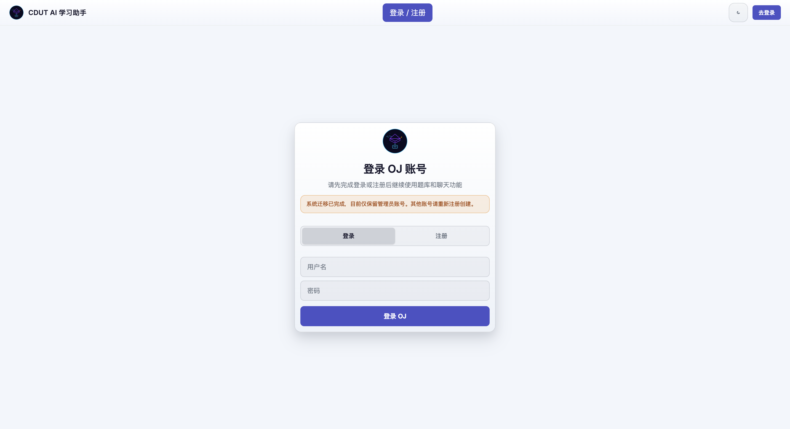

页面 `/auth`，可在「登录 / 注册」之间切换。

### 注册

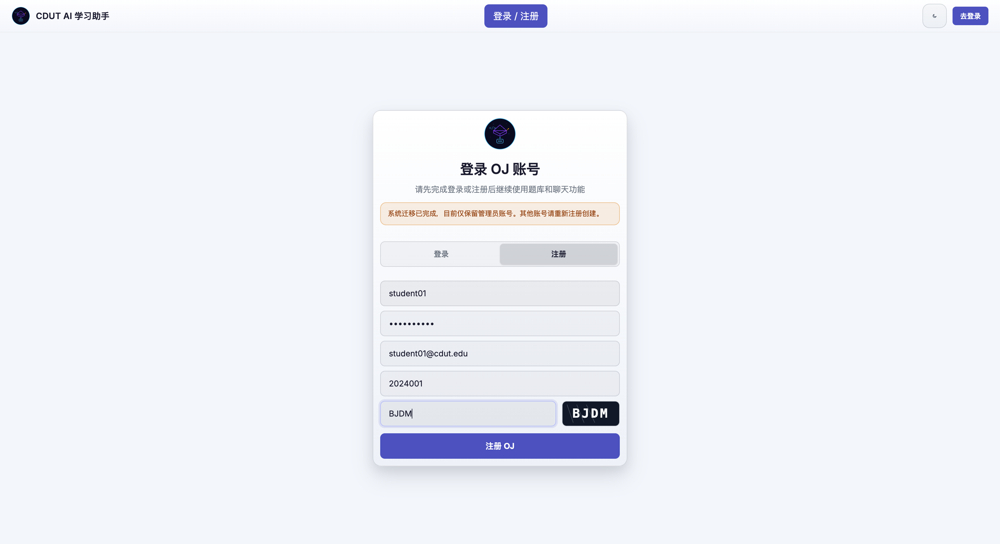

1. 点击「注册」切换到注册模式。
2. 填写**用户名**、**密码**（≥6 位）。
3. 可选填**邮箱**、**学号**。
4. 输入**验证码**（点击验证码图片可刷新）。
5. 点击「注册 OJ」。成功后自动登录并进入主页。

> 注意：系统迁移后仅保留管理员账号，**普通学生需自行注册**。账号体系由后端 `ai_agent.local_users` 维护（与历史 qduoj 用户表独立）。

### 登录

输入用户名 + 密码，点击「登录 OJ」。登录态基于后端会话 Cookie，刷新页面保持登录。右上角按钮显示当前用户名；点击进入个人中心。

---

## 3. 主页：AI 学习对话

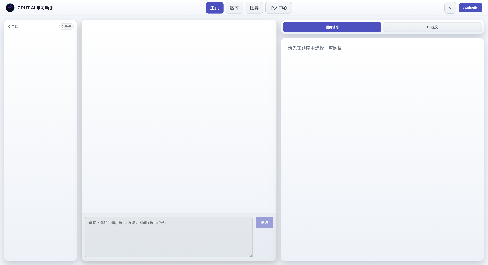

主页为三栏布局：

| 区域 | 内容 |
|------|------|
| 左侧栏 | 会话列表（每个会话对应一道题或一次自由对话），顶部显示会话数与「清空所有对话」 |
| 中间 | 对话区 + 底部输入框 |
| 右侧栏 | 「题目信息」/「OJ提交」两个标签页 |

### 发起对话

- 在底部输入框输入问题，**Enter 发送，Shift+Enter 换行**。
- AI 回复以**流式**方式逐字返回。
- 回复上方会出现**下一步建议**胶囊（📖 这道题在考什么 / 🎯 给个思路提示 / 🐛 调试 / 🏆 去比赛 等），点击即按该意图继续提问。

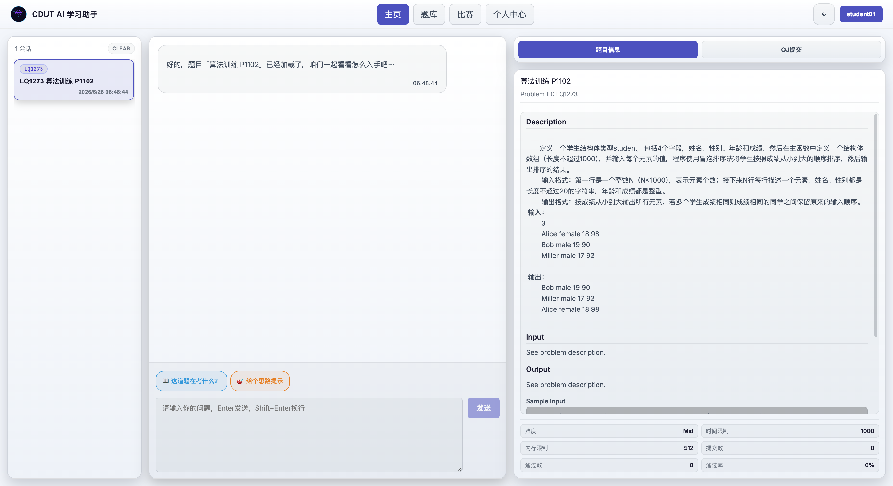

### 多智能体与执行轨迹

后端是一个 **supervisor 多智能体**系统，会把问题路由到子智能体：
`code_reviewer`（代码评审）、`problem_analyzer`（问题解析）、`contest_coach`（竞赛教练）、`learning_partner`（学习伙伴）、`learning_manager`（学习管理）。

处理过程中输入框上方会显示**执行轨迹条**（如 `🧠 问题解析专家 ⟳ 运行中 / ✓ 已完成`）。

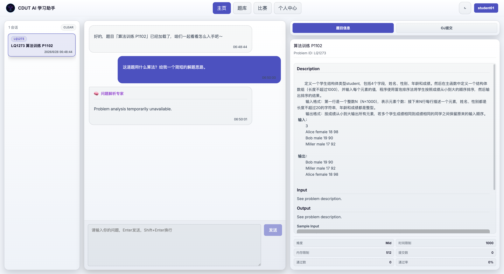

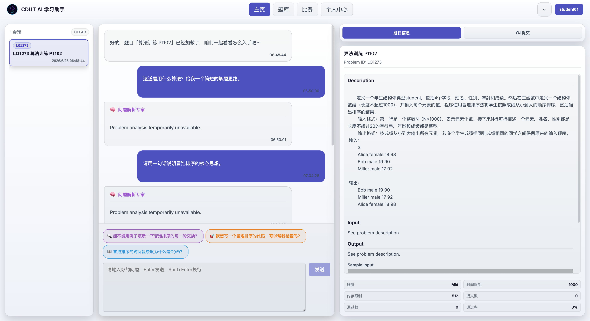

> **重要**：AI 文本生成依赖外部 LLM（默认 DeepSeek）。配置有效 `UTU_LLM_API_KEY` 后，子智能体返回完整回答（如上图「问题解析专家」给出冒泡排序讲解并反问追问）。若 Key 无效/欠费，则返回「temporarily unavailable」兜底文案（接口本身正常，仅 LLM 调用失败）。更换 Key 后**必须重建容器**（`up -d --force-recreate`，仅 `restart` 不会重新读取 `.env`），详见部署手册 §12、§18。

### 把代码 / 判题结果发给 AI（暂存附件流）

在「OJ提交」面板里点「发给AI」**不会立即发送**，而是把代码（以及上一次判题结果）作为**附件胶囊**暂存到输入框上方。你可以检查后再点「发送」，附件会以 `[Attachment] 文件名` + 代码块形式拼进消息。这样能把「代码 + 报错结果」一并交给 AI 点评。

---

## 4. 题库：浏览与选题

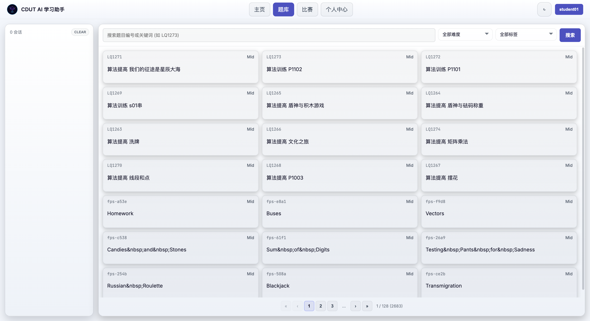

页面 `/problemset`：

- **搜索**：按题号或关键词（如 `LQ1273`）。
- **筛选**：难度（Low / Mid / High）、标签（蓝桥杯-算法提高、Dynamic Programming、Greedy、Math 等）。
- **分页**：每页 21 题，底部数字翻页（验证环境共 2683 题 / 128 页）。
- 点击任意题目卡片 → 自动创建/切换到该题的学习会话，加载题面，AI 给出迎语，并跳转主页。

管理员在题库页额外可见「新增题目」按钮，每个题卡有「编辑」按钮。

---

## 5. 题目详情与 OJ 代码提交

选题后，主页右侧栏「题目信息」标签展示题面：描述、输入/输出格式、样例输入输出、提示（时间/内存限制）、来源、难度、提交数/通过数/通过率。

### 提交代码

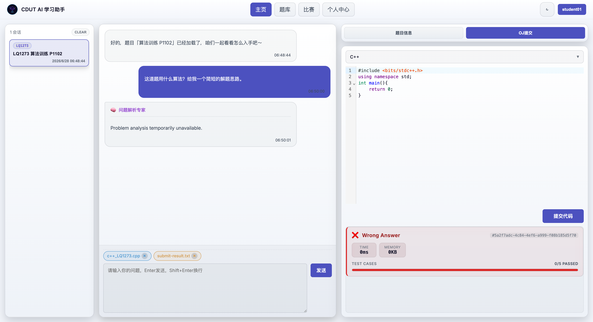

切到右侧栏「OJ提交」标签：

1. 选择语言（C++ / C / Java / Python3），编辑器带各语言起始模板。
2. 在 CodeMirror 编辑器写代码（语法高亮）。
3. 点击「提交代码」。
4. 结果区显示判题中（Judging…）→ 最终结果：
   - 状态标签：`Accepted` / `Wrong Answer` / `Compile Error` / `Runtime Error` / `Time Limit Exceeded` 等；
   - **Score / Time(ms) / Memory(KB)**；
   - **测试点通过数**（如 `0/5 PASSED`）；
   - 出错时显示错误信息块。

> 判题链路：前端 → `ai-agent-lite` → `cdut-sandbox`（isolate 沙盒）按题目对应的测试用例逐点运行 → 返回结果。需测试用例已恢复到 `data/test_cases`（见部署手册 §15）。

每个会话的提交草稿（语言 + 代码 + 结果）会被独立保存，切换会话不丢失。

---

## 6. 比赛

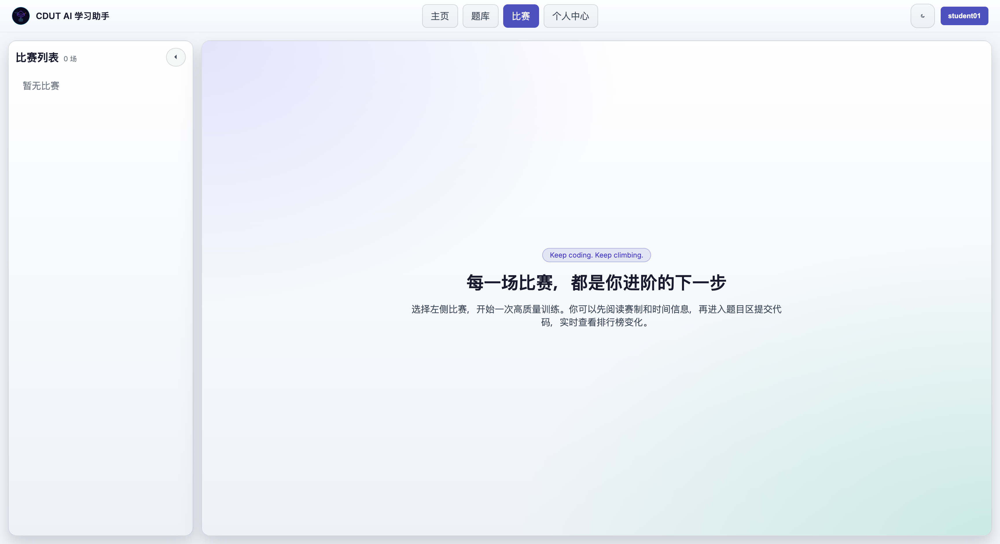

页面 `/contest`，左侧为比赛列表，右侧为比赛工作区：

- 比赛卡片显示状态徽标：**即将开始 / 进行中 / 已结束**，以及报名按钮。
- 选中比赛后右侧展示：标题、描述、起止时间、报名状态、题目数量，以及**实时倒计时**（开赛倒计时 / 剩余时间）。
- **进行中**且**已报名**才可在赛内提交代码（流程同 §5）。
- 右侧**排行榜**：按通过数、罚时排序，分页显示；点击选手可查看其个性签名。
- 排行榜横幅会标注「进行中临时榜单 / 最终榜单」。

管理员可见「新增比赛」按钮。

### 学生参赛流程（实测）

1. 进入「比赛」，左侧选择一场**进行中**的比赛（卡片有绿色「进行中」徽标与「参加」按钮）。
2. 点击「参加 / 报名」完成报名，右侧「报名状态」变为**已报名**。
3. 在「赛题列表」点击题目（A/B/C…），右侧展示题面与代码编辑器。
4. 选语言 → 写代码 → 「提交代码」，结果区显示判题结果；提交后排行榜刷新。

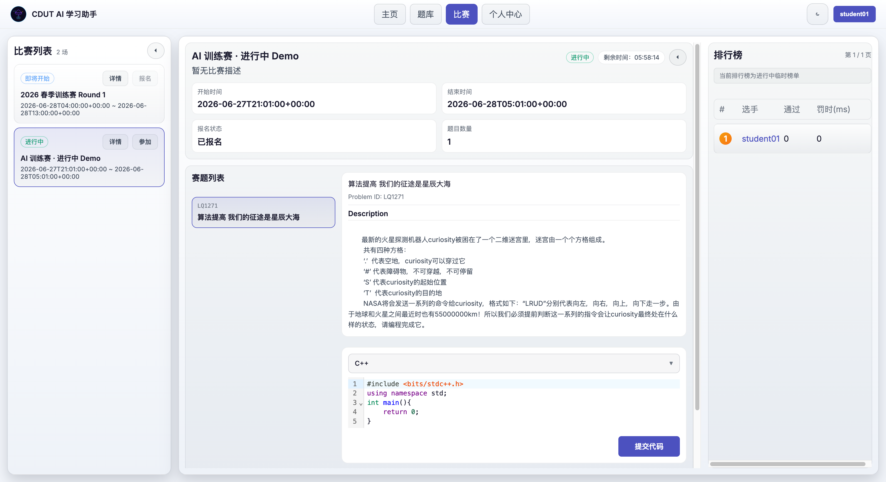

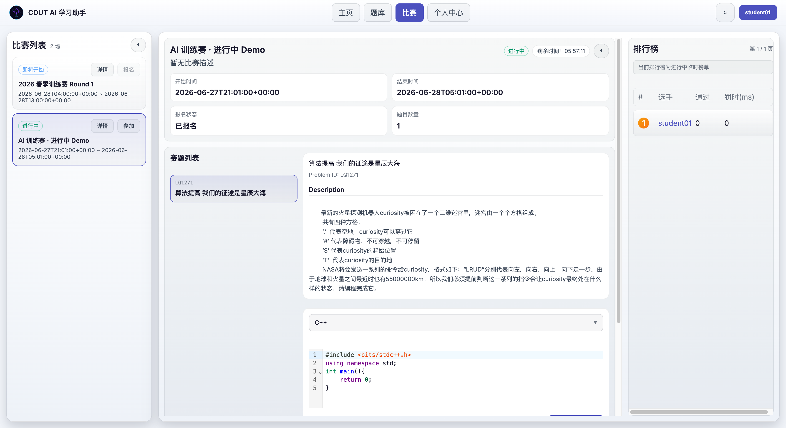

> 仅**进行中且已报名**才显示提交入口；未开始/已结束会显示对应提示（「比赛尚未开始」/「提交入口已关闭」）。
> 排行榜按通过数、罚时排序，横幅标注「进行中临时榜单 / 最终榜单」。

---

## 7. 个人中心

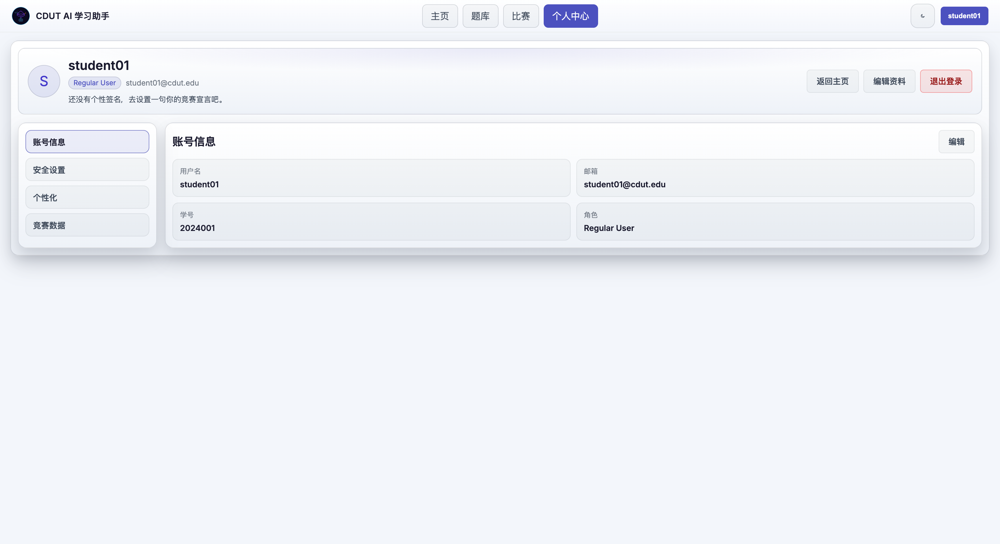

页面 `/profile`，顶部 Hero 展示头像（用户名首字母）、角色徽标（Regular User / Admin / Super Admin）、邮箱、个性签名。左侧分区导航：

| 分区 | 功能 |
|------|------|
| 账号信息 | 查看用户名/邮箱/学号/角色；「编辑」可改邮箱、学号 |
| 安全设置 | 修改密码（需旧密码校验，新密码 ≥6 位、两次一致） |
| 个性化 | 编辑个性签名（≤280 字） |
| 竞赛数据 | 登录状态、身份级别、资料完整度 |

右上角可「返回主页」「编辑资料」「退出登录」。

---

## 8. 管理后台（管理员）

仅 `admin_type ≥ 1` 的账号在导航栏看到「管理」入口（`/admin`），普通用户访问会被重定向回主页。登录管理员账号后顶部导航多出「管理」一项。

### 8.1 账号管理（`/admin`）

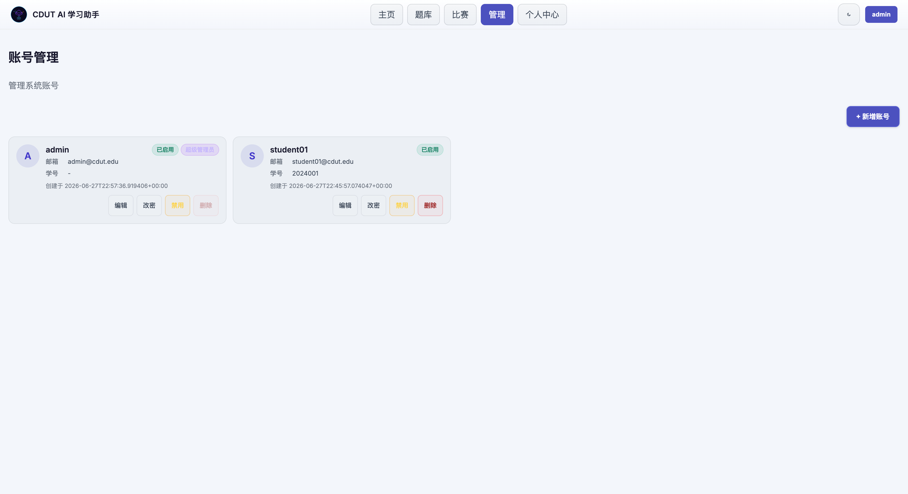

- 卡片列表展示所有账号（用户名、邮箱、学号、启用状态、权限徽标、创建时间），分页（每页 12 条）。
- 每张卡片操作：**编辑**（邮箱/学号/权限级别）、**改密**、**启用/禁用**、**删除**。
- 权限级别：普通用户(0) / 管理员(1) / 超级管理员(2)；只有超级管理员能创建或设置超级管理员。
- 安全限制：不能禁用或删除**当前登录账号**（删除按钮置灰）。

**新增账号**弹窗（用户名、初始密码、邮箱、学号、权限级别）：

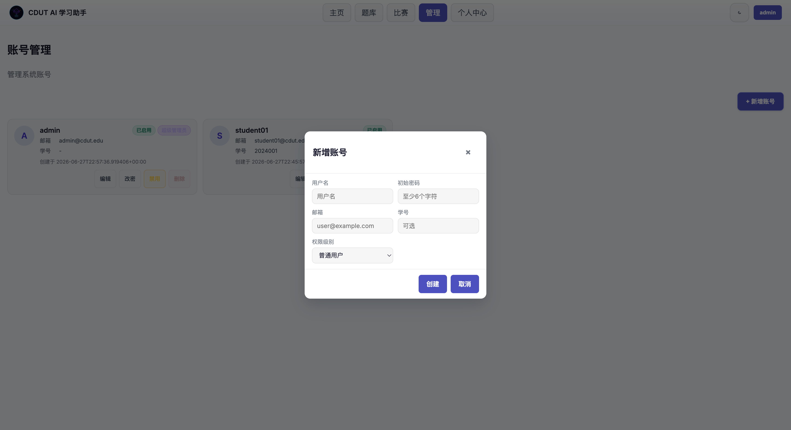

### 8.2 题库管理（题库页）

管理员在题库页右上角可见「新增题目」，每个题卡有「编辑」按钮：

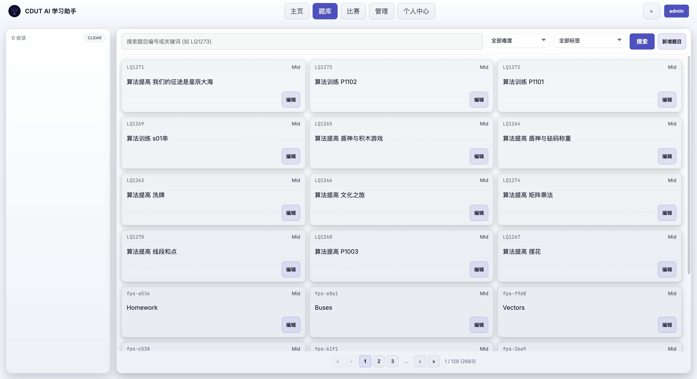

**新增题目**弹窗支持「单题上传 / 批量导入」两种模式，单题表单含：标题、难度、来源、题目描述、输入/输出描述、样例（可多组）、提示、标签、各语言模板代码（C/C++/Java/Python3）、测试数据（可多组）、时间/内存限制、特殊判题(SPJ)、公开可见：

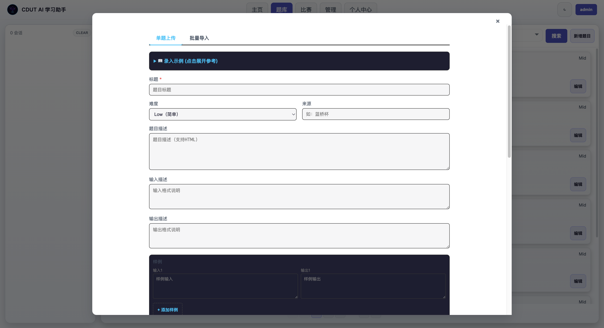

「编辑」题目可改题面、可见性、标签（`ProblemEditModal`）。

### 8.3 比赛管理（比赛页）

管理员在比赛列表可见「新增比赛」。弹窗含「比赛信息 / 题目信息」两个标签：

- **比赛信息**：标题、描述、开始/结束时间、对学生可见开关。
- **题目信息**：从右侧题库筛选并点选题目（按 A、B、C 排定），左侧显示已选题目。

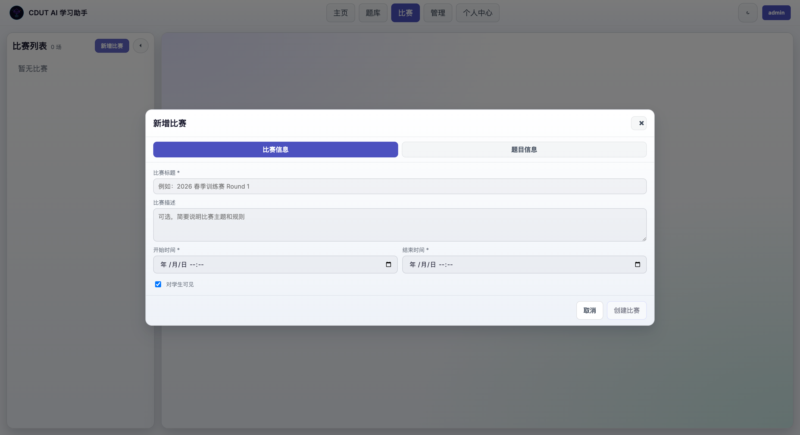

创建后比赛即出现在列表，按时间自动推导状态（即将开始/进行中/已结束）。下图为一场创建后**进行中**的比赛，带实时剩余倒计时、赛题列表与排行榜：

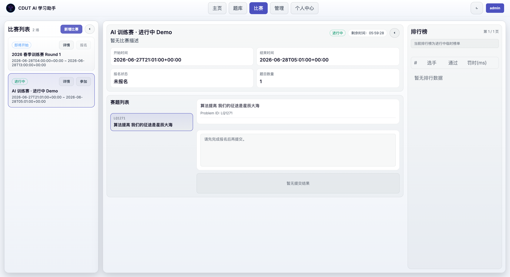

> ⚠️ 时间字段说明：前端创建比赛时会把所填时间按 **UTC** 提交（`normalizeDateTime` 追加 `Z`）。若希望比赛「立即进行中」，填写开始/结束时间时需按 UTC 时间填（比北京时间早 8 小时），否则会比预期晚 8 小时开赛。

---

## 9. 通用功能

- **主题切换**：顶部栏「Switch to dark/light theme」按钮，明暗主题切换，偏好本地保存。
- **会话管理**：左侧栏可切换会话、查看创建时间；「clear」清空所有会话并跳转题库。
- **退出登录**：个人中心或右上角用户菜单。

---

# 第二部分 系统部署手册

## 10. 架构与端口

```
浏览器  (下为单套部署内部拓扑；公共/本地为两套独立部署，各一份)
  │  入口: 公共 http://8.137.155.24/(:80 反代→5173) 或 本地 http://localhost:5173/
  ├─ vue-ai-chat (Vite dev server, 宿主 5173)
  │     ├─ /ws       → ws://ai-agent-lite:8848   (WebSocket 代理)
  │     ├─ /oj-api   → http://ai-agent-lite:8848 (REST 代理, 去前缀)
  │     └─ /oj-test-cases → http://ai-agent-lite:8848/oj
  │
ai-agent-lite (FastAPI, 容器内 8848 → 宿主 8850)
  ├─ PostgreSQL  cdut-postgres   (schema: public=OJ数据, ai_agent=会话/账号)
  ├─ Redis       cdut-redis      (Celery broker/backend)
  ├─ Celery      cdut-ai-agent-celery-worker  (题目审核 audit 队列)
  └─ Sandbox     cdut-sandbox    (isolate 判题, 宿主 8899)
```

### 宿主端口占用（本项目）

| 服务 | 宿主端口 | 说明 |
|------|---------|------|
| vue-ai-chat | **5173** | 前端 |
| ai-agent-lite | **8850** | 后端 API/WS（容器内 8848）|
| cdut-sandbox | **8899** | 判题沙盒 |
| cdut-postgres | 仅容器内 5432 | **不映射宿主**，避免与其他项目冲突 |
| cdut-redis | 仅容器内 6379 | **不映射宿主** |

> **避免与其他 Docker 项目冲突**：本项目所有容器名带 `cdut-` 前缀，跑在独立的 `cdut-network` 桥接网络，Postgres/Redis 不暴露宿主端口。已确认 5173 / 8850 / 8899 与宿主上其它项目（magicedit-* 占用 80/3306/6379/8500 等、dreampal-* 占用 8300/8400/8600 等）**无端口冲突**。

### 10.1 两个访问地址的区别

两个地址是**两套相互独立的部署**，各自有独立的数据库、账号、题库与会话数据——**不互通、不同步**：

| 地址 | 类型 | 部署位置 | 数据 | 端口 |
|------|------|---------|------|------|
| `http://8.137.155.24/` | **公共测试地址**（外网） | 云服务器 | 独立一套 | 80（反向代理转发到容器 5173） |
| `http://localhost:5173/` | **本地部署地址**（本机） | 本机 Docker | 独立一套 | 5173（compose 直接映射宿主） |

说明：

- 二者**不是同一套数据**：在公共地址注册的账号，在本地地址登录不了，反之亦然；题库/比赛/提交记录各自独立。
- 公共地址走 80 端口，由云服务器上的反向代理（如 Nginx）转发到容器 5173；本地地址直连 compose 映射的 5173。
- 异地访问只能用公共测试地址；本机开发/调试用本地地址。
- 后端 API/沙盒端口（8850 / 8899）仅供**各自所在主机本机**调用（健康检查、排错），未公网暴露。

**基础管理员账号**（**本地部署**，由本手册 §16 方式 B 创建）：

| 用户名 | 密码 | 权限 |
|--------|------|------|
| `admin` | `admin123456` | 超级管理员（admin_type=2） |

> 该账号属于本地部署。公共测试地址为独立环境，管理员账号由该服务器维护方提供，未必相同。
> ⚠️ 生产/公网环境请立即修改默认密码或删除该账号（个人中心 → 安全设置，或管理后台 → 改密）。

---

## 11. 前置条件

- Docker + Docker Compose v2。
- 磁盘空间：镜像约 6GB（含 isolate 沙盒、Node、Python），测试用例解压约数百 MB。
- 一个**有效的 LLM API Key**（默认 DeepSeek `chat.completions` 接口）——AI 对话功能必需。

---

## 12. 环境变量配置

项目根目录 `.env`（参考 `.env.example`）。关键项：

```bash
# LLM（必需 —— AI 对话依赖）
UTU_LLM_TYPE=chat.completions
UTU_LLM_MODEL=deepseek-chat
UTU_LLM_BASE_URL=https://api.deepseek.com/v1
UTU_LLM_API_KEY=<你的有效 Key>      # ← 务必有效，否则 AI 回复 401 兜底

# 搜索（可选）
SERPER_API_KEY=<可选>

# 题目审核 Celery worker 用的 LLM（可选）
# XIAOMI_API_KEY=<可选>            # 未设置时 worker 仅警告，不影响主流程

# 前端端口（compose 内已固定）
UTU_WEBUI_PORT=8848
TZ=Asia/Shanghai
```

> **校验 LLM Key 是否有效**：
> ```bash
> curl -s -o /dev/null -w "%{http_code}\n" -X POST https://api.deepseek.com/v1/chat/completions \
>   -H "Authorization: Bearer $UTU_LLM_API_KEY" -H "Content-Type: application/json" \
>   -d '{"model":"deepseek-chat","messages":[{"role":"user","content":"hi"}],"max_tokens":5}'
> ```
> 返回 `200` 为有效；`401` 表示 Key 无效/欠费（此时 AI 对话会回退为「temporarily unavailable」）。
>
> **更换 Key 后必须重建容器**（`restart` 不会重新注入 `compose` 的环境变量）：
> ```bash
> docker compose up -d --force-recreate ai-agent-lite ai-agent-celery-worker
> ```
> 重建后浏览器刷新页面重连 WebSocket 即可。

---

## 13. 一键启动

```bash
cd /path/to/cdut_stu_agents
docker compose up -d --build
```

启动 6 个服务：`cdut-postgres`、`cdut-redis`、`cdut-sandbox`、`ai-agent-lite`、`ai-agent-celery-worker`、`vue-ai-chat`。

> **首次构建注意**：`cdut-sandbox` 基于 `ubuntu:24.04` 需 `apt-get` 安装 isolate/JDK 等，偶发网络抖动导致 `exit code 100`。重试即可：
> ```bash
> docker compose build cdut-sandbox && docker compose up -d
> ```

> **启动时序**：`ai-agent-lite` 依赖 Postgres，首启可能因 Postgres 尚未就绪而 `ConnectionRefusedError` 退出。Postgres 起来后重启一次后端即可：
> ```bash
> docker compose restart ai-agent-lite ai-agent-celery-worker
> ```
> （后端 `restart: unless-stopped`，多数情况下会自愈。）

启动后后端会自动执行 `init_db()`：创建 `ai_agent` schema 及 `local_users` / `sessions` / `messages` 等表（幂等）。

---

## 14. 数据库与题库种子恢复

**全新 Postgres 卷不含 OJ 题库数据**（`public.problem` 等表不存在，题库/比赛页会 500）。需恢复种子库。

备份位于 `backups/`：

| 文件 | 内容 |
|------|------|
| `qduoj_full_20260424_234948.sql` | 全量 SQL（`public.*` OJ 表：problem/user/contest/submission + `ai_agent.*`）|
| `qduoj_full_20260424_234948.dump` | 同上，pg_restore 自定义格式 |
| `qduoj_testcase_20260424_234948.tar.gz` | 测试用例文件 |

**恢复（追加式，向已存在的 `cdut_oj` 库导入）**：

```bash
docker exec -i cdut-postgres psql -U cdut -d cdut_oj -v ON_ERROR_STOP=0 \
  < backups/qduoj_full_20260424_234948.sql
```

> `ai_agent.*` 表因后端已建会报「already exists / multiple primary keys」——**可忽略**，`public.*` OJ 表会正常创建并载入数据。

**校验**：

```bash
docker exec cdut-postgres psql -U cdut -d cdut_oj -t -c \
  "SELECT 'problems='||count(*) FROM public.problem;"
# 预期：problems=2683
```

恢复后重启后端使其连上完整库：`docker compose restart ai-agent-lite`。

---

## 15. 测试用例恢复

判题需要测试用例落到 `data/test_cases/<test_case_id>/`（compose 已挂载该目录到沙盒 `/data/test_cases`）。

```bash
tar xzf backups/qduoj_testcase_20260424_234948.tar.gz \
  -C data/test_cases --strip-components=1
# 校验：
ls data/test_cases | wc -l        # 预期约 3528 个用例目录
```

> tar 内顶层为 `test_case/`，故用 `--strip-components=1` 去掉前缀。

可通过 `TEST_CASES_HOST_PATH` 环境变量自定义宿主测试用例目录（默认 `./data/test_cases`）。

---

## 16. 创建首个账号 / 管理员

账号存于 `ai_agent.local_users`，恢复后仍为空。两种方式：

**方式 A（推荐，走正常流程）**：浏览器打开 `http://localhost:5173/auth` → 注册（含验证码）。第一个注册的是普通用户。

**方式 B（脚本造管理员，需直连 DB）**：用后端自带的密码哈希工具生成 Django 兼容 `pbkdf2_sha256` 哈希再插库：

```bash
HASH=$(docker exec cdut-ai-agent-lite \
  python -c "from app.utils.auth_helpers import hash_password; print(hash_password('你的密码'))")

docker exec cdut-postgres psql -U cdut -d cdut_oj -c \
  "INSERT INTO ai_agent.local_users (username,password_hash,email,admin_type,is_disabled,created_at,updated_at)
   VALUES ('admin','$HASH','admin@cdut.edu',2,false,now(),now())
   ON CONFLICT (username) DO UPDATE SET password_hash=EXCLUDED.password_hash, admin_type=2;"
```

`admin_type`：0=普通，1=管理员，2=超级管理员。建好后即可登录并看到「管理」入口。

> 当前验证环境已用方式 B 创建超级管理员：**用户名 `admin` / 密码 `admin123456`**（`admin_type=2`）。生产环境请立即改密或删除。

---

## 17. 健康检查与冒烟测试

```bash
# 后端就绪（db / llm / model）
curl -s http://localhost:8850/readyz
# 预期：{"ok":true,"db":true,"llm":true,"model":"deepseek-chat"}

# 前端
curl -s -o /dev/null -w "%{http_code}\n" http://8.137.155.24/     # 200

# 题库 API（需已恢复种子库）
curl -s "http://localhost:8850/api/problem/?offset=0&limit=2"

# 题目详情
curl -s "http://localhost:8850/api/problem/?problem_id=LQ1273"
```

> `readyz` 的 `llm:true` 仅表示**配置存在**，不代表 Key 有效；真实有效性以 §12 的直连测试为准。

完整页面冒烟（已验证）：注册登录 → 题库筛选/翻页 → 选题建会话 → AI 迎语 → 题面展示 → OJ 提交得到判题结果（含测试点）→ 个人中心 → 比赛空状态。

---

## 18. 常见问题排查

| 现象 | 原因 | 处理 |
|------|------|------|
| 题库/比赛页 500，日志 `relation "problem" does not exist` | 未恢复种子库 | 执行 §14 |
| AI 回复「temporarily unavailable」，日志 `LLM server returned 401` | `UTU_LLM_API_KEY` 无效/欠费 | 换有效 Key 后 `docker compose up -d --force-recreate ai-agent-lite ai-agent-celery-worker`（**注意**：`restart` 不重读 `.env`，必须 `--force-recreate`），再刷新页面重连 |
| 后端启动即退出 `ConnectionRefusedError` | Postgres 未就绪先于后端 | `docker compose restart ai-agent-lite ai-agent-celery-worker` |
| `cdut-sandbox` 构建 `exit code 100` | apt 镜像网络抖动 | 重试 `docker compose build cdut-sandbox` |
| 提交一直 Judging / 判题失败 | 测试用例缺失或沙盒未起 | 检查 §15；`docker compose ps cdut-sandbox`；沙盒需 `privileged` |
| worker 警告 `XIAOMI_API_KEY is not set` | 题目审核 LLM 未配 | 可忽略（不影响主流程），如需审核功能则配置 |
| 端口冲突 | 5173/8850/8899 被占 | 改 `docker-compose.yml` 端口映射 |

查看日志：

```bash
docker compose logs -f ai-agent-lite
docker compose logs --tail=50 cdut-sandbox
docker compose ps
```

---

## 19. 停止 / 重建 / 备份

```bash
# 停止（保留数据卷）
docker compose down

# 停止并删除数据（危险：清空 DB 卷与测试用例需自行确认）
docker compose down            # 数据在宿主 ./data 下，down 不会删 bind 挂载

# 重建单个服务
docker compose up -d --build vue-ai-chat

# 备份数据库
docker exec cdut-postgres pg_dump -U cdut -d cdut_oj > backups/cdut_oj_$(date +%Y%m%d).sql
```

数据持久化在宿主：`./data/postgres`（库）、`./data/redis`、`./data/test_cases`、`./data/{submissions,training,chat_history,problems}`。

---

*前端能力以 `frontend-vue-ai-chat` 当前代码为准。*
